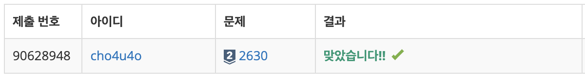

`25/02/26`

## 2630: 색종이 만들기

<a href="https://www.acmicpc.net/problem/2630">백준 2630</a>

## 풀이

```Plain text
계속 잘라서 하얀색 색종이가 몇 개인지, 파란색 색종이가 몇 개인지
파악하는 문제입니다.

잘랐을 때 요소의 색이 모두 같은지 검사해야 할 것 같고,
같으면 더 자르지 않고
다르면 더 자르게 되겠는데요
자른 범위를 큐에 넣어 검사하면 되지 않을까 싶고

상하좌우라고 해야하나 방향 정보도 상수로 정리하면 될 듯 하구요

길이가 1이 아닐 때까지 총길이 / 2 floor값으로 상하좌우를 나눠 주면
될 것 같네요

전체적인 실행 순서는,

1. 입력을 받고 보드를 만들어준다
2. 보드내부 요소들이 모두 같은지 검사하는 함수 정의
3. 보드를 나누어 4등분된 보드를 리턴하는 함수 정의
4. 보드를 검사하는 절차가 있는 함수 실행
5. 보드가 같은가? -> 보드의 첫번째 칸의 숫자에 따라 카운트 저장
6. 보드 길이가 1인가? -> 마찬가지로 숫자에 따라 카운트 저장
7. 위 두가지가 아니면 보드를 나누고, 나눈값을 대상으로
8. 계속 보드 검사 함수 실행해서 해당 부분의 최종 카운트를 받아온다.
9. 최종적으로는 1/4파트에 대해 계속 나누어 검사 후 2/4 파트에 대해 검사, ... 하여 4/4 파트까지 모든 작업을 수행 후 결과를 반환한다.
```

## 해결



```Plain text
이건 중간에 나눈 값들을 어떻게 처리하고 재귀 처리를 어떻게 할지에 대해
검색을 좀 했어서 한번에 맞게 되었습니다....
BFS 조금 더 풀면서 실력 디벨롭 해야겠습니다...
```
